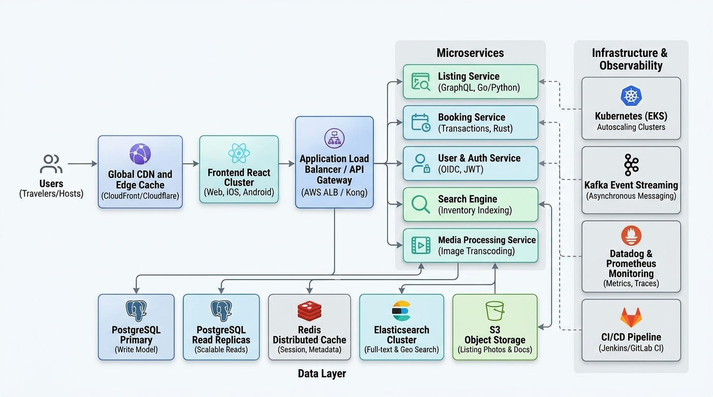

# Playpower Labs Airbnb Clone

## Overview
This repository contains an original, high-fidelity React implementation reproducing the desktop Airbnb listing experience for **"Private Jacuzzi 1BHK Candolim PV203/UV30"** in Goa, India.

Built as a submission for the **Playpower Labs Senior Frontend Engineer Take-Home Assignment**, this application demonstrates visual and behavioral parity across three primary surfaces:
1. **Interactive Listing Detail Page** (Header, Asymmetric Hero Grid, Sticky Reservation Widget, Expandable Details, Dual-Month Availability Calendar, Detailed Review Breakdowns, Neighborhood Map, and Carousel Stays).
2. **Photo Tour Experience** (Full-screen categorized room-by-room gallery with smooth anchor scrolling).
3. **High-Resolution Lightbox** (Accessible full-screen carousel with keyboard controls and synchronized indices).

---

## Features

- **Asymmetric Hero Image Grid**: Precision 5-tile grid (50% dominant hero on left, 2x2 supporting tiles on right) with 8px gaps, rounded corners, and a floating *"Show all photos"* trigger.
- **Sticky Reservation Card**:
  - Live pricing synchronization (`₹28,499` for 5 nights).
  - Custom interactive Date Picker with range highlighting and month navigation.
  - Interactive Guest Selector dropdown (Adults, Children, Infants, Pets) with boundary checks.
  - Promotional discount notification banner.
- **Full-Screen Photo Tour**:
  - Categorized by room: *Living room 1, Living room 2, Full kitchen, Bedroom, Full bathroom, Gym, Exterior, Pool, and Additional photos*.
  - Sticky header with quick-nav thumbnails and smooth scroll links.
- **Accessible Lightbox**:
  - Direct opening to the exact clicked image.
  - Keyboard navigation: `Left Arrow` (previous), `Right Arrow` (next), `Escape` (close).
  - Real-time `X of Y` image counter and room category title.
- **Rich Listing Details**:
  - Interactive "Save to Wishlist" heart toggle.
  - Translation notice banner with "Show original".
  - Expandable description with "Show more" / "Show less".
  - Sleeping arrangement cards with room previews.
  - "Show all 50 amenities" modal with full category breakdown and focus trap.
  - Comprehensive reviews with 4.95 overall rating, category metric bars, and tags.
  - Candolim neighborhood map visual with zoom controls.
  - Paginated (1/2) "More stays nearby" card row.

---

## Tech Stack

- **Framework**: [React 18](https://react.dev/) + [TypeScript](https://www.typescriptlang.org/)
- **Bundler & Dev Server**: [Vite](https://vitejs.dev/)
- **Styling**: [Tailwind CSS](https://tailwindcss.com/)
- **Iconography**: [Lucide React](https://lucide.dev/)
- **Architecture**: Domain-driven typing, local reactive state, and custom accessibility hooks.

---

## Project Structure

```
airbnb/
├── .agents/
│   ├── ui-reviewer.md                # Specialized UI visual parity review role
│   ├── accessibility-reviewer.md     # WCAG & keyboard focus review role
│   └── architecture-reviewer.md      # Code boundaries & TypeScript review role
├── docs/
│   └── architecture.png              # Production-scale marketplace cloud architecture
├── prompts/
│   └── development-prompts.md        # Prompt log documenting all AI development steps
├── public/
│   └── images/                       # Extracted reference listing photo assets
├── src/
│   ├── components/
│   │   ├── Header/                   # Main desktop navigation header & search pill
│   │   ├── PropertyHeader/           # Listing title, share, and interactive wishlist
│   │   ├── HeroGallery/              # 5-photo grid and gallery trigger
│   │   ├── BookingCard/              # Sticky reservation sidebar card
│   │   ├── DatePicker/               # Dual-month calendar with range selection
│   │   ├── GuestSelector/            # Dynamic guest counter dropdown
│   │   ├── PropertySummary/          # Specs and laurel wreath Guest Favourite badge
│   │   ├── HostSection/              # Host overview and core property highlights
│   │   ├── Description/              # Collapsible description with translation banner
│   │   ├── SleepingArrangements/     # Bedroom and living room bed arrangement cards
│   │   ├── Amenities/                # 2-column feature list & 50-amenity dialog
│   │   ├── Reviews/                  # Category score breakdown, tags, and reviews modal
│   │   ├── LocationSection/          # Candolim map and neighborhood highlights
│   │   ├── HostProfile/              # Host statistics card, co-hosts, and messaging
│   │   ├── ThingsToKnow/             # 3-column policies and house rules
│   │   ├── NearbyStays/              # Paginated nearby recommendations
│   │   ├── Footer/                   # Global Airbnb footer links and currency picker
│   │   ├── PhotoTour/                # Full-screen categorized room tour
│   │   └── Lightbox/                 # Modal lightbox with carousel navigation
│   ├── data/
│   │   └── property.ts               # Centralized typed property data model
│   ├── hooks/
│   │   ├── useLockBodyScroll.ts      # Prevents background scroll without layout shift
│   │   ├── useKeyboardNavigation.ts  # Arrow keys and Escape handler
│   │   └── useFocusTrap.ts           # Traps focus in modals and restores focus on close
│   ├── types/
│   │   └── property.ts               # TypeScript domain interfaces
│   ├── pages/
│   │   └── ListingPage.tsx           # Page-level orchestrator
│   ├── App.tsx                       # Root component
│   ├── main.tsx                      # DOM entrypoint
│   └── index.css                     # Design tokens and base styles
├── index.html
├── tailwind.config.js
├── tsconfig.json
├── vite.config.ts
└── package.json
```

---

## Running Locally

### Prerequisites
- Node.js (v18 or newer recommended, tested on Node v24)
- npm

### Installation
```bash
npm install
```

### Start Development Server
```bash
npm run dev
```
The application will launch on `http://localhost:3000`.

---

## Build

To compile TypeScript and create a production build:
```bash
npm run build
```
To preview the built production bundle:
```bash
npm run preview
```

---

## AI-Assisted Development

This implementation was developed using an agentic pairing workflow in the Google Antigravity IDE. The process included:
- **Visual & Audio Decomposition**: Analyzing the reference screen recording frame-by-frame to extract exact content, metrics, prices, and layouts.
- **Autonomous Component Synthesis**: Structuring modular React TypeScript components adhering to clean code and single-responsibility principles.
- **Rigorous Verification**: Continuous TypeScript type-checking, headless browser verification, and iterative visual comparisons.

All prompts used during development are transparently documented in [`prompts/development-prompts.md`](prompts/development-prompts.md).

---

## Accessibility

The application implements WCAG 2.1 AA accessibility guidelines:
- **Keyboard Navigation**:
  - `Escape`: Closes Lightbox, Photo Tour, Date Picker, Guest Selector, and Amenities modals.
  - `ArrowLeft` / `ArrowRight`: Advances or rewinds images in the Lightbox.
  - `Tab`: Navigates between interactive elements in logical order.
- **Focus Management**:
  - Handled via `useFocusTrap`. When a modal opens, focus is directed inside the modal container. Upon closing, focus is automatically returned to the triggering element.
- **Scroll Management**:
  - Handled via `useLockBodyScroll`. Locks `document.body` scrolling while calculating scrollbar width to eliminate layout shifts.
- **Semantic HTML & ARIA**:
  - Native `<button>` elements with descriptive `aria-label` attributes.
  - Modals use `role="dialog"` with `aria-modal="true"` and `aria-labelledby`.
  - Proper image `alt` attributes across all listing assets.

---

## Architecture

A production-scale vacation-rental marketplace requires an elastic, fault-tolerant cloud architecture capable of handling millions of concurrent travelers and hosts worldwide.

The architecture diagram is located at [`docs/architecture.png`](docs/architecture.png):



### Key Architectural Highlights:
1. **Edge & Frontend Layer**:
   - CloudFront / Cloudflare Edge CDN providing SSL termination, DDoS protection, and caching of static assets.
   - React Single Page App / SSR cluster deployed globally for low-latency initial page loads.
2. **API & Routing Tier**:
   - Application Load Balancers and Kong API Gateway managing rate limiting, authentication token verification (JWT/OIDC), and routing to microservices.
3. **Microservice Mesh**:
   - **Listing Service**: GraphQL/gRPC APIs managing inventory and metadata.
   - **Booking & Reservation Service**: High-concurrency ACID transactions handling reservations and idempotency.
   - **Search & Discovery Engine**: Elasticsearch/OpenSearch clusters handling geo-distance and filter queries.
   - **Media Processing Pipeline**: Asynchronous image transcoding and multi-resolution responsive generation.
4. **Data & Caching Tier**:
   - **PostgreSQL**: Write models with active-active or multi-region read replicas.
   - **Redis Cluster**: Distributed caching for session management and hot listing metadata.
   - **S3 Object Storage**: Scalable image and document storage.
5. **Observability & DevOps**:
   - Kubernetes (EKS) with Horizontal Pod Autoscaling (HPA).
   - Kafka event streaming for asynchronous notifications and bookings.
   - Datadog & Prometheus metrics, Grafana dashboards, and OpenTelemetry tracing.

---

## Design / Implementation Notes

- **Independent Clean-Room Reproduction**: This codebase was created entirely from visual and behavioral analysis of the provided screen recording. No proprietary Airbnb source code, styles, or JavaScript were copied or reverse-engineered.
- **Desktop Target**: Optimized specifically for desktop viewports (`1440px` reference width), maintaining visual stability across `1280px`, `1366px`, `1440px`, and `1600px`.
# airbnb-page

